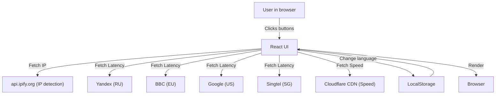
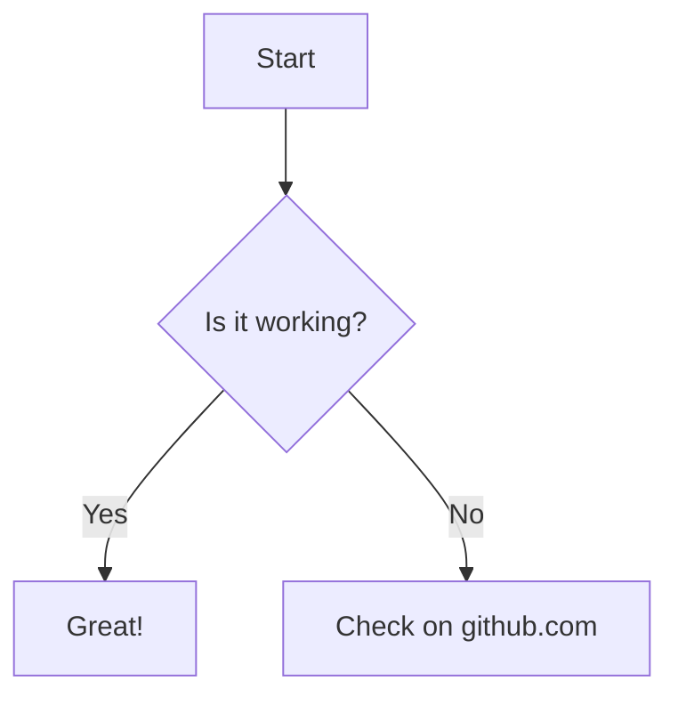

# 🌐 Connection Tester

A modern web app for testing your internet connection quality from anywhere in the world. Instantly check your public IP, latency to major global regions, and download speed from different locations. Supports English and Russian languages.

## 🚀 Features

- **IP Detection** — Instantly shows your public IP address.
- **Latency Test** — Measures ping to Russia, Europe, US, Singapore, Brazil, India, Australia, South Africa, Japan, and Canada (with flags and translations).
- **Download Speed** — Measures download speed from Cloudflare (US) and Singapore endpoints.
- **Language Switch** — Interface in English 🇬🇧 or Russian 🇷🇺, with instant switching and local storage.
- **Modern UI/UX** — Futuristic design, glassmorphism, responsive layout, and flag icons.
- **No tracking, no ads, open source.**

## 🖥️ How to run

1. Install Node.js (if not installed): https://nodejs.org/
2. Install dependencies:
   ```bash
   npm install
   ```
3. Start the app:
   ```bash
   npm start
   ```
4. Open [http://localhost:3000](http://localhost:3000) in your browser.

## 📦 Project structure

```
connection-tester/
  public/
    favicon.ico
    index.html
  src/
    App.js        # Main app logic and UI
    App.css       # Main styles
    index.js      # Entry point
    index.css     # Global styles
  package.json
  README.md
```

## 🗺️ How it works





## 📝 License

MIT. Use, modify, and share freely.

---

Made with ❤️ by shapez0r & GitHub Copilot, 2025.