# 🌐 Connection Tester

A modern web app for testing your internet connection quality from anywhere in the world. Instantly check your public IP, latency to major global regions, and download speed from different locations. Supports English and Russian languages.

## 🚀 Features

- **IP Detection** — Instantly shows your public IP address.
- **Latency Test** — Measures ping to Moscow, London, New York, Singapore, São Paulo, Mumbai, Sydney, Johannesburg, Tokyo, and Toronto (with flags and translations).
- **Download Speed** — Measures download speed from New York and Singapore endpoints.
- **Language Switch** — Interface in English 🇬🇧 or Russian 🇷🇺, with instant switching and local storage.
- **Modern UI/UX** — Futuristic design, glassmorphism, responsive layout, and flag icons.
- **No tracking, no ads, open source.**

## 🖥️ How to run

1. Install Node.js (https://nodejs.org/)
2. Install dependencies:
   ```bash
   npm install
   ```
3. Start the app locally:
   ```bash
   npm start
   ```
4. Open [http://localhost:3000](http://localhost:3000) in your browser.

## 📦 Project structure

```
connection-tester/
  public/
    favicon.ico
    index.html
  src/
    App.js        # Main app logic and UI
    App.css       # Main styles
    index.js      # Entry point
    index.css     # Global styles
  package.json
  README.md
```

## 🗺️ How it works


- The app is built with React (JavaScript).
- On load, it fetches your public IP from https://api.ipify.org.
- Latency is measured by sending fetch requests to major global sites (Yandex, BBC, Google, etc.).
- Download speed is measured by downloading a test file from Cloudflare endpoints.
- The UI supports English and Russian, with instant switching and local storage of language preference.
- All logic and UI are in `src/App.js` and `src/App.css`.
- Deployment is automated to GitHub Pages (see workflow below).

## 🤖 Инструкции для ИИ

**ВАЖНО: ИИ должен всегда отвечать пользователю ТОЛЬКО НА РУССКОМ ЯЗЫКЕ, независимо от языка запроса. При каждом запросе пользователя ИИ обязан следовать этой инструкции из README.**

```mermaid
flowchart TD
    A[Пользователь диктует изменения ИИ] --> B[ИИ применяет изменения в коде]
    B --> C[ИИ обновляет проверочный скрипт]
    C --> D[ИИ отправляет изменения в GitHub]
    D --> E[ИИ запускает деплой]
    E --> F[ИИ проверяет ID коммита]
    F --> G[ИИ проверяет актуальные изменения]
    G --> H{НАЙДЕНО?}
    H -- Да --> I[Изменение активно!]
    H -- Нет --> B
```



После каждого изменения ИИ должен:

1. Применить запрошенные изменения в приложении
2. Обновить скрипт проверки для новых функций
3. Закоммитить и отправить изменения:
   - `git add .`
   - `git commit -m "описание изменений"`
   - `git push`
4. Развернуть приложение:
   - `npm run deploy`
5. Дождаться распространения деплоя
6. Запустить проверку
7. Подтвердить успех или исправить, если проверка не прошла

## 🔍 Verification Script

The repository includes an automated shell verification script: `check-tester.sh`.

- This script checks that the latest deployed version of the site contains the expected phrase or feature (for example, the current app name).
- The script automatically finds the correct deployed JS file and searches for the expected value.
- Always update this script to match the latest change you want to verify after deployment.
- Run it after each deployment to ensure your change is live:

```bash
bash ./check-tester.sh
```

If the script outputs `FOUND`, your change is present on the live site.

## 🛠️ Deployment Workflow

1. **Commit and Push Changes**: Stage, commit, and push the changes to the repository.
2. **Deploy the Application**: Use `npm run deploy` to deploy the updated application.
3. **Wait for Deployment Propagation**: Allow some time for the deployment to propagate or manually confirm the deployment is live.
4. **Verify Deployment**: Run `check-tester.sh` to confirm the changes are live.

## Deployment & Verification Workflow

1. Make the required changes in the application code (src/).
2. Update the verification script (`check-tester.sh`) so it checks for the new/changed feature (e.g., a new phrase or color).
3. Run the following commands:
   - `git add .`
   - `git commit -m "describe your change"`
   - `git push`
4. Deploy to GitHub Pages:
   - `npm run deploy`
5. Wait for deployment propagation or manually confirm the deployment is live.
6. Run the verification script:
   - `bash ./check-tester.sh`
7. Make sure the script outputs `FOUND` — this means the change is live on the site.

> Always keep the verification script up to date with the latest change you want to check after deployment!

## 📝 License

MIT. Use, modify, and share freely.

---

Made with ❤️ by shapez0r & GitHub Copilot, 2025.